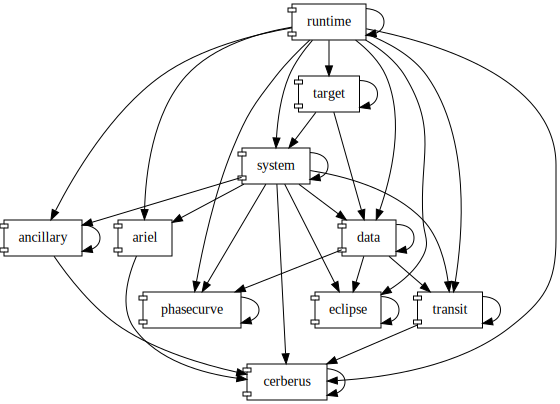

# ESP as a Pipeline

## Definitions

__data process__
: a set of algorithms which operate on a set of input data (input data product) to produce a related collection of output data (output data product)

__data product__
: a collection of data that is considered interesting on its own

__pipeline__
: a series of data process steps that flow data products from the first input to last output

__run id__
: a monotonic measure that is monotonic with respect to wall time but not uniform with respect to wall time.

## Introduction

The ESP software is a set of data processes called tasks that, when run together, make it a pipeline. Each of these tasks are broken up further into:

__Algorithm__
: software that is target invariant

__Aspect__
: software that cuts across targets

__Regression__
: software that is examines a target over run id

The starting data product is spectral images from various instruments. The data then flows through the collection of tasks, algorithms, aspects, and regressions to produce it final data product; the spectral content of exoplanets.

We often talk about two types of pipelines: operational and private. They only difference between them is the operational is notionally public while the private is notionally private. Other than these notional access differences, they are the ame. In reality, everyone has the same access to private pipelines as they do operational ones.

## Description

Because the actual pipeline changes as we commit and update code, the description here is a highlight of the tasks and algorithms from moment in time. To know its current form, you would have to start a pipeline and [view it live](interact). However, reading through this should provide the ability to interpret the live diagrams.

The ESP tasks and how they relate to each other are in this figure:

